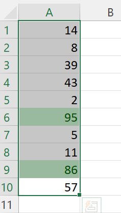
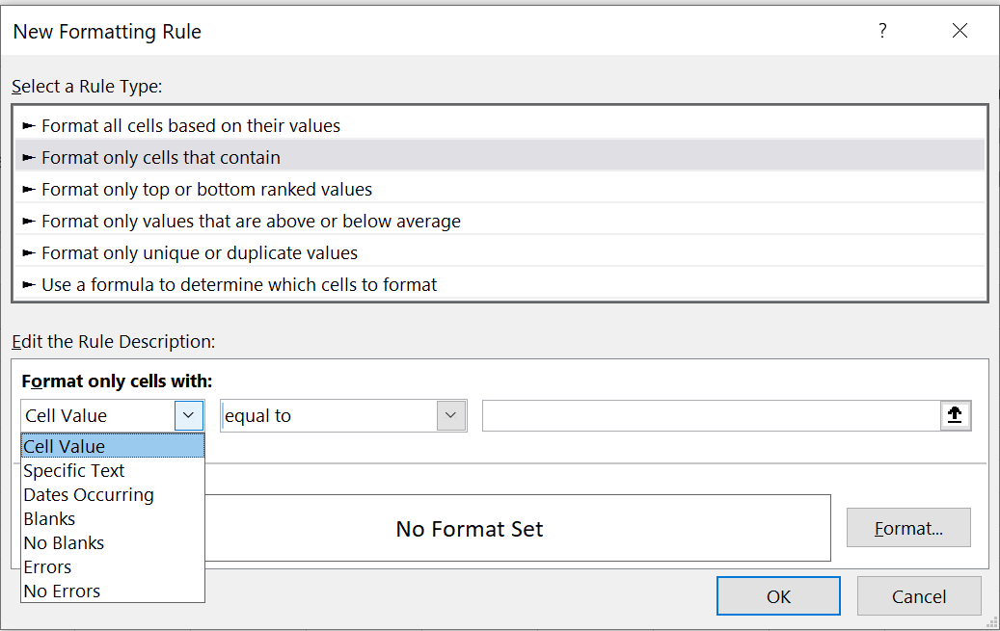

# Conditional Formatting

## Introduction

In addition to standard cell formatting options, most spreadsheet software provides an option known as Conditional Formatting, which allows formatting options to be set based on the value of a cell.

The cell's standard formatting defines most style elements that will always be applied, such as the font face and size; but Conditional Formatting allows you to override some elements of that cell style such as number format mask; font colour, bold, italic and underlining; borders and fill colour and pattern.

Conditional Formatting can be applied to individual cells, or to a range of cells.

### Example

As a simple example in MS Excel itself, if we wanted to highlight all cells in the range A1:A10 that contain values greater than 80, start by selecting the range of cells.


On the Home tab, in the "Styles" group, click "Conditional Formatting". This allows us to select an Excel Wizard to guide us through the process of creating a Conditional Rule and defining a Style for that rule.


Click "Highlight Cells Rules", then "Greater Than".


Enter the value "80" in the prompt box; and either select one of the pre-defined formatting style (or create a custom style from there).


Then click "OK". The rule is immediately applied to the selected range of cells, highlighting all those with a value greater than 80 in the chosen style.



Any change to the value of a cell within that range will immediately check the rule, and automatically apply the new styling if it applies.


If we wanted to set up the same Conditional Formatting rule in PHPSpreadsheet, we would do so using the following code:

```php
$conditional = new \PhpOffice\PhpSpreadsheet\Style\Conditional();
$conditional->setConditionType(\PhpOffice\PhpSpreadsheet\Style\Conditional::CONDITION_CELLIS);
$conditional->setOperatorType(\PhpOffice\PhpSpreadsheet\Style\Conditional::OPERATOR_GREATERTHAN);
$conditional->addCondition(80);
$conditional->getStyle()->getFont()->getColor()->setARGB(\PhpOffice\PhpSpreadsheet\Style\Color::COLOR_DARKGREEN);
$conditional->getStyle()->getFill()->getColor()->setARGB(\PhpOffice\PhpSpreadsheet\Style\Color::COLOR_GREEN);

$conditionalStyles = $spreadsheet->getActiveSheet()->getStyle('A1:A10')->getConditionalStyles();
$conditionalStyles[] = $conditional;

$spreadsheet->getActiveSheet()->getStyle('A1:A10')->setConditionalStyles($conditionalStyles);
```

Depending on the Rules that we might want to apply for a Condition, sometimes an "operator Type" is required, sometimes not (and not all Operator Types are appropriate for all Condition Types); sometimes a "Condition" is required (or even several conditions), sometimes not, and sometimes it must be a specific Excel formula expression. Creating conditions manually requires a good knowledge of when these different properties need to be set, and with what type of values. This isn't something that an end-user developer should be expected to know. 

So - to eliminate this need for complex and arcane knowledge - since PHPSpreadsheet verson 1.22.0 there is also a series of Wizards that can assist with creating Conditional Formatting rules, and which is capable of setting the appropriate operators and conditions for a Conditional Rule:

```php
$wizardFactory = new \PhpOffice\PhpSpreadsheet\Style\ConditionalFormatting\Wizard('A1:A10');
$wizard = $wizardFactory->newRule(\PhpOffice\PhpSpreadsheet\Style\ConditionalFormatting\Wizard::CELL_VALUE);
$wizard->greaterThan(80);
$wizard->getStyle()->getFont()->getColor()->setARGB(\PhpOffice\PhpSpreadsheet\Style\Color::COLOR_DARKGREEN);
$wizard->getStyle()->getFill()->getColor()->setARGB(\PhpOffice\PhpSpreadsheet\Style\Color::COLOR_GREEN);

$conditional = $wizard->getConditional();
```
The Wizard knows which operator types match up with condition types, and provides more meaningful method names for operators, and builds expressions when required; and it also works well with an IDE.

---

Note that `$conditionalStyles` is an array: it is possible to apply several conditions to the same range of cells. If we also wanted to highlight values that were less than 10 in the the A1:A10 range, we can add a second style rule.

In Excel, we would do this by selecting the range again, and going through the same process, this time selecting the "Highlight Cells Rules", then "Less Than" from the "Conditional Styles" menu, entering the value "10" in the prompt box, and selecting the appropriate style.

In PHPSpreadsheet, we would do:

```php
$conditional2 = new \PhpOffice\PhpSpreadsheet\Style\Conditional();
$conditional2->setConditionType(\PhpOffice\PhpSpreadsheet\Style\Conditional::CONDITION_CELLIS);
$conditional2->setOperatorType(\PhpOffice\PhpSpreadsheet\Style\Conditional::OPERATOR_LESSTHAN);
$conditional2->addCondition(10);
$conditional2->getStyle()->getFont()->getColor()->setARGB(\PhpOffice\PhpSpreadsheet\Style\Color::COLOR_DARKRED);
$conditional2->getStyle()->getFill()->getColor()->setARGB(\PhpOffice\PhpSpreadsheet\Style\Color::COLOR_RED);

$conditionalStyles = $spreadsheet->getActiveSheet()->getStyle('A1:A10')->getConditionalStyles();
$conditionalStyles[] = $conditional2;

$spreadsheet->getActiveSheet()->getStyle('A1:A10')->setConditionalStyles($conditionalStyles);
```
or again, using the Wizard:
```php
$wizardFactory = new \PhpOffice\PhpSpreadsheet\Style\ConditionalFormatting\Wizard('A1:A10');
$wizard = $wizardFactory->newRule(\PhpOffice\PhpSpreadsheet\Style\ConditionalFormatting\Wizard::CELL_VALUE);
$wizard->lessThan(10);
$wizard->getStyle()->getFont()->getColor()->setARGB(\PhpOffice\PhpSpreadsheet\Style\Color::COLOR_DARKGREEN);
$wizard->getStyle()->getFill()->getColor()->setARGB(\PhpOffice\PhpSpreadsheet\Style\Color::COLOR_GREEN);

$conditional = $wizard->getConditional();
```

## Wizards

While the Wizards don't simplify defining the Conditional Style itself; they do make it easier to define the conditions (the rules) where that style will be applied. 



The Wizard Factory allows us to retrieve the appropriate Wizard for the CF Rule that we want to apply. Most of those that have already been defined fall under the "Format only cells that contain" category.
MS Excel provides a whole series of different types of rule, each of which has it's own formatting and logic. The Wizards try to replicate this logic and behaviour, similar to Excel's own "Formatting Rule" helper wizard.

MS Excel | Wizard newRule() Type Constant | Wizard Class Name
---|---|---
Cell Value | Wizard::CELL_VALUE | CellValue
Specific Text | Wizard::TEXT_VALUE | TextValue
Dates Occurring | Wizard::DATES_OCCURRING | DateValue
Blanks | Wizard::BLANKS | Blanks
No Blanks | Wizard::NOT_BLANKS | Blanks
Errors | Wizard::ERRORS | Errors 
No Errors | Wizard::NOT_ERRORS | Errors

We instantiate the Wizard Factory, passing in the cell range where we want to apply Conditional Formatting rules; and can then call the `newRule()` method, passing in the type of Conditional Rule that we want to create to return the appropriate Wizard:

```phpregexp
$wizardFactory = new \PhpOffice\PhpSpreadsheet\Style\ConditionalFormatting\Wizard('C3:E5');
$wizard = $wizardFactory->newRule(\PhpOffice\PhpSpreadsheet\Style\ConditionalFormatting\Wizard::CELL_VALUE);
```
That Wizard then provides methods allowing us to define the rule, setting the operator and the values that we want to compare for that rule.
Note that not all rules require values, or even operators, but the individual Wizards provide whatever is necessary; and this document lists all options available for every Wizard.

### CellValue Wizard

For the `CellValue` Wizard, we always need to provide an operator and a value; and for the "between" and "notBetween" operators, we need to provide two values to specify a range.

Condition Type | Wizard Type | Operator Type | Wizard Operators | Notes
---|---|---|---|---
Conditional::CONDITION_CELLIS | Wizard::CELL_VALUE | Conditional::OPERATOR_EQUAL | equals()
| | | Conditional::OPERATOR_NOTEQUAL | notEquals()
| | | Conditional::OPERATOR_GREATERTHAN | greaterThan()
| | | Conditional::OPERATOR_GREATERTHANOREQUAL | greaterThanOrEqual()
| | | Conditional::OPERATOR_LESSTHAN | lessThan()
| | | Conditional::OPERATOR_LESSTHANOREQUAL | lessThanOrEqual()
| | | Conditional::OPERATOR_BETWEEN | between()
| | | Conditional::OPERATOR_NOTBETWEEN | notBetween()
| | | | and() | Used to provide the second operand for `between()` and `notBetween() 

A single operator call is required for every rule (except `between()` and `notBetween`, where the Wizard also provides `and()`); and providing a value is mandatory for all operators.
The values that we need to provide for each operator can be numeric, boolean or string literals (even NULL); cell references; or formulae.

So to set the rule using an operator, we would make a call like:
```php
$wizard->lessThan(10);
```
or when setting a `between()` or `notBetween()` rule, we can make use of the fluent interface with the `and()` method to set the range of values:
```php
$wizard->between(-10)->and(10);
```

To retrieve the Conditional, to add it to our `$conditionalStyles` array, we call the Wizard's `getConditional()` method.
```php
$conditional = $wizard->getConditional();
$conditionalStyles = [];
```
or simply
```php
$conditionalStyles[] = $wizard->getConditional();
```

#### Value Types

##### Literals

If the value is a literal (even a string literal), we simply need to pass the value; the Wizard will ensure that strings are correctly quoted when we get the Conditional from the Wizard.

```php
$wizard->equals('Hello World');
```
If you weren't using the Wizard, you would need to remember to wrap this value in quotes yourself (`'"Hello World"'`)  

However, a cell reference or a formula are also string data, so we need to tell the Wizard if the value that we are passing in isn't just a string literal value, but should be treated as a cell reference or as a formula.

##### Cell References

If we want to use the value from cell `H9` in our rule; then we need to pass a value type of `VALUE_TYPE_CELL` to the operator, in addition to the cell reference itself.


You can find an example that demonstrates this in the [code samples](https://github.com/PHPOffice/PhpSpreadsheet/blob/master/samples/ConditionalFormatting/01_Basic_Comparisons.php#L103 "Conditional Formatting - Basic Comparisons") for the repo.

```php
$wizard->equals('$H$9', Wizard::VALUE_TYPE_CELL);
```
Note that we pass it as an absolute cell reference, "pinned" (with the `$` symbol) for both the row and the column.

In this next example, we need to use relative cell references, so that the comparison will match the value in column `A` against the values in columns `B` and `C` for each row in our range (`A18:A20`); ie, test if the value in `A18` is between the values in `B18` and `C18`, test if the value in `A19` is between the values in `B19` and `C19`, etc.  


```php
$wizard->between('$B1', Wizard::VALUE_TYPE_CELL)
    ->and('$C1', Wizard::VALUE_TYPE_CELL)
    ->setStyle($greenStyle);
```

This example can also be found in the [code samples](https://github.com/PHPOffice/PhpSpreadsheet/blob/master/samples/ConditionalFormatting/01_Basic_Comparisons.php#L126 "Conditional Formatting - Basic Comparisons") for the repo.

In this case, we "pin" the column for the address; but leave the row "unpinned".
Notice also that we treat the first cell in our range as cell `A1`: the relative row number will be adjusted automatically to match each row in our defined range; that is, the range that we specified when we instantiated the Wizard, passed in through the Wizard Factory.

##### Formulae

```php
$wizard->equals('AVERAGE($B1:$C1)', Wizard::VALUE_TYPE_FORMULA);
```

### TextValue Wizard

For the `TextValue` Wizard, we always need to provide an operator and a value.

Condition Type | Wizard Type | Operator Type | Wizard Operators
---|---|---|---
Conditional::CONDITION_CONTAINSTEXT | Wizard::TEXT_VALUE | Conditional::OPERATOR_CONTAINSTEXT | contains()
Conditional::CONDITION_NOTCONTAINSTEXT | Wizard::TEXT_VALUE | Conditional::OPERATOR_NOTCONTAINS | doesNotContain()
Conditional::CONDITION_BEGINSWITH | Wizard::TEXT_VALUE | Conditional::OPERATOR_BEGINSWITH | beginsWith()
Conditional::CONDITION_ENDSWITH | Wizard::TEXT_VALUE | Conditional::OPERATOR_ENDSWITH | endsWith()

The Conditional actually uses a separate "Condition Type" for each, each with its own "Operator Type", and the condition should be an Excel formula (not simply the string value to check), and with a custom `text` attribute. The Wizard should make it a lot easier to create these condition rules.

