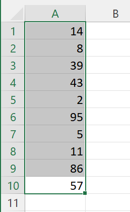
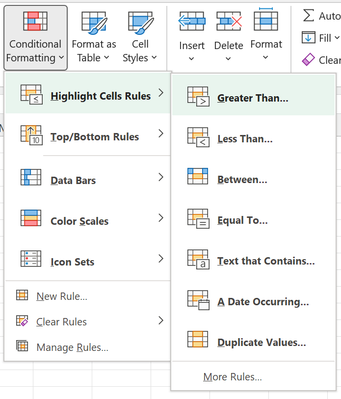
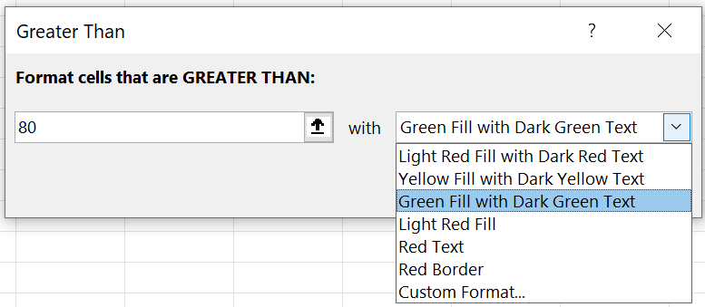

# Conditional Formatting

## Introduction

In addition to standard cell formatting options, most spreadsheet software provides an option known as Conditional Formatting, which allows formatting options to be set based on the value of a cell.

The cell's standard formatting defines most style elements that will always be applied, such as the font face and size; but Conditional Formatting allows you to override some elements of that cell style such as number format mask; font colour, bold, italic and underlining; borders and fill colour and pattern.

Conditional Formatting can be applied to individual cells, or to a range of cells.

### Example

As a simple example in MS Excel itself, if we wanted to highlight all cells in the range A1:A10 that contain values greater than 80, start by selecting the range of cells.



On the Home tab, in the "Styles" group, click "Conditional Formatting".


Click "Highlight Cells Rules", then "Greater Than".



Enter the value "80" in the prompt box; and either select one of the pre-defined formatting style (or create a custom style from there).



Then click "OK". The rule is immediately applied to the selected range of cells, highlighting all those with a value greater than 80 in the chosen style.


Any change to the value of a cell within that range will immediately check the rule, and automatically apply the new styling if it applies.


If we wanted to set up the same Conditional Formatting rule in PHPSpreadsheet, we would do so using the following code:

```php
$conditional = new \PhpOffice\PhpSpreadsheet\Style\Conditional();
$conditional->setConditionType(\PhpOffice\PhpSpreadsheet\Style\Conditional::CONDITION_CELLIS);
$conditional->setOperatorType(\PhpOffice\PhpSpreadsheet\Style\Conditional::OPERATOR_GREATERTHAN);
$conditional->addCondition(80);
$conditional->getStyle()->getFont()->getColor()->setARGB(\PhpOffice\PhpSpreadsheet\Style\Color::COLOR_DARKGREEN);
$conditional->getStyle()->getFill()->getColor()->setARGB(\PhpOffice\PhpSpreadsheet\Style\Color::COLOR_GREEN);

$conditionalStyles = $spreadsheet->getActiveSheet()->getStyle('A1:A10')->getConditionalStyles();
$conditionalStyles[] = $conditional;

$spreadsheet->getActiveSheet()->getStyle('A1:A10')->setConditionalStyles($conditionalStyles);
```

Note that `$conditionalStyles` is an array: it is possible to apply several conditions to the same range of cells. If we also wanted to highlight values that were less than 10 in the the A1:A10 range, we can add a second style rule.

In Excel, we would do this by selecting the range again, and going through the same process, this time selecting the "Highlight Cells Rules", then "Less Than" from the "Conditional Styles" menu, entering the value "10" in the prompt box, and selecting the appropriate style.

In PHPSpreadsheet, we would do:

```php
$conditional2 = new \PhpOffice\PhpSpreadsheet\Style\Conditional();
$conditional2->setConditionType(\PhpOffice\PhpSpreadsheet\Style\Conditional::CONDITION_CELLIS);
$conditional2->setOperatorType(\PhpOffice\PhpSpreadsheet\Style\Conditional::OPERATOR_LESSTHAN);
$conditional2->addCondition(10);
$conditional2->getStyle()->getFont()->getColor()->setARGB(\PhpOffice\PhpSpreadsheet\Style\Color::COLOR_DARKRED);
$conditional2->getStyle()->getFill()->getColor()->setARGB(\PhpOffice\PhpSpreadsheet\Style\Color::COLOR_RED);

$conditionalStyles = $spreadsheet->getActiveSheet()->getStyle('A1:A10')->getConditionalStyles();
$conditionalStyles[] = $conditional2;

$spreadsheet->getActiveSheet()->getStyle('A1:A10')->setConditionalStyles($conditionalStyles);
```
